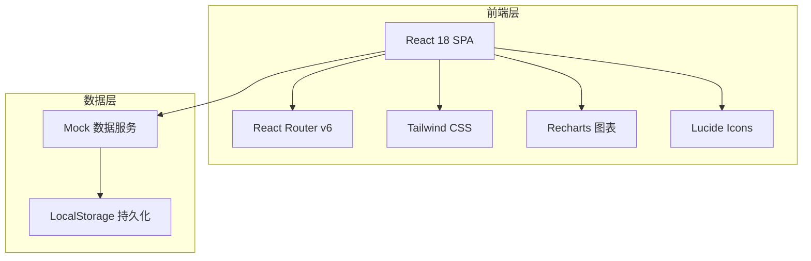
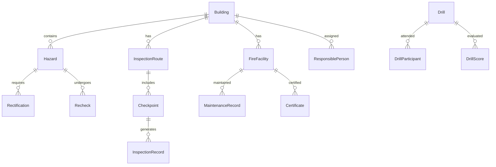

## 1. 架构设计



## 2. 技术说明

- **前端框架**：React@18 + TypeScript
- **样式方案**：Tailwind CSS@3
- **构建工具**：Vite
- **路由**：React Router v6
- **图表库**：Recharts（环形图、进度图）
- **图标库**：Lucide React
- **动画库**：Framer Motion
- **后端**：无（使用 Mock 数据 + LocalStorage）
- **数据库**：无（前端 Mock 数据模拟）

## 3. 路由定义

| 路由 | 用途 |
|------|------|
| `/` | 总览页，风险等级、待办统计、近期报警 |
| `/hazards` | 隐患页，隐患列表与管理 |
| `/inspections` | 巡检页，楼栋巡检路线与记录 |
| `/drills` | 演练页，演练计划与评分 |
| `/archives` | 档案页，建筑/设施/维保/证书管理 |

## 4. 数据模型

### 4.1 数据模型定义



### 4.2 数据定义

```typescript
interface Building {
  id: string
  name: string
  floors: number
  area: number
  fireLevel: "一级" | "二级" | "三级" | "四级"
  address: string
  responsiblePersonId: string
}

interface Hazard {
  id: string
  buildingId: string
  location: string
  description: string
  level: "一般" | "较大" | "重大" | "特别重大"
  status: "待分派" | "整改中" | "待复查" | "已关闭" | "已超期"
  photos: string[]
  createdAt: string
  deadline: string
  assigneeId: string
  rectification?: Rectification
  rechecks: Recheck[]
}

interface Rectification {
  assigneeId: string
  deadline: string
  requirement: string
  completedAt?: string
  photos: string[]
}

interface Recheck {
  id: string
  hazardId: string
  result: "通过" | "不通过"
  opinion: string
  photos: string[]
  createdAt: string
}

interface InspectionRoute {
  id: string
  buildingId: string
  checkpoints: Checkpoint[]
}

interface Checkpoint {
  id: string
  floor: number
  location: string
  type: "灭火器" | "喷淋" | "通道"
  status: "正常" | "异常" | "缺失"
}

interface InspectionRecord {
  id: string
  routeId: string
  inspectorId: string
  startTime: string
  endTime: string
  items: {
    checkpointId: string
    status: "正常" | "异常" | "缺失"
    photo?: string
    remark?: string
  }[]
}

interface Drill {
  id: string
  type: "灭火演练" | "疏散演练" | "综合演练"
  buildingId: string
  scheduledAt: string
  status: "计划中" | "进行中" | "已完成"
  participants: DrillParticipant[]
  scores: DrillScore[]
  issues: string[]
}

interface DrillParticipant {
  id: string
  name: string
  checkedIn: boolean
  checkedInAt?: string
}

interface DrillScore {
  item: string
  maxScore: number
  actualScore: number
}

interface FireFacility {
  id: string
  buildingId: string
  type: "灭火器" | "喷淋头" | "烟感报警器" | "消防栓" | "应急灯"
  location: string
  quantity: number
  status: "正常" | "维修中" | "报废"
  lastCheckDate: string
}

interface MaintenanceRecord {
  id: string
  facilityId: string
  date: string
  content: string
  operator: string
  nextDate: string
}

interface Certificate {
  id: string
  facilityId: string
  name: string
  issueDate: string
  expiryDate: string
  status: "正常" | "临期" | "已过期"
}

interface ResponsiblePerson {
  id: string
  name: string
  phone: string
  role: "安全员" | "物业主管"
  buildingIds: string[]
}
```
